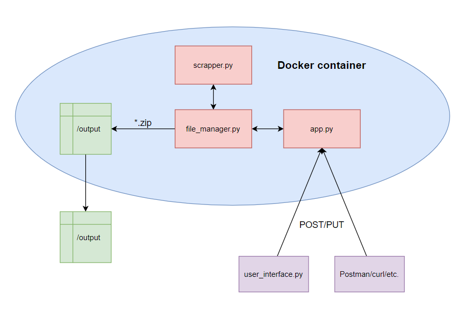

# Scraper obrazów i tekstu

# Wymagania:
- Docker
- Docker-compose
- python - do user_interface.py(opcjonalne)

# Użytkowanie:
- W folderze z projektem: 
```
    docker-compose up --build
```

- Wysłanie REST POST na adres **0.0.0.0:5000** o składni:
```json
{
"url": "<adres_url_z_którego_chcemy_pobrać>",
"option": "all <ALBO> text <ALBO> images"
}
```
aby pobrać odpowiednio: wszystko, tylko tekst, tylko obrazy z danego adresu url. Można też wysłać polecenie GET aby
uzyskać info o składni polecenia POST.

- Skorzystanie z **user_interface** uruchamiając go:
```shell script
python user_interface.py
```

# Schemat:



# Opis działania skrócony
- Aplikacja pobiera z danego url tekst i/lub obrazy, następnie zapisuje je do pliku .zip oraz tworzy logi z danej
operacji. Pliki tworzone są w folderze './output' systemu.

# Opis działania dokładny
- Po otrzymaniu żądania POST, aplikacja sprawdza poprawność adresu URL dzięki bibliotece **validators**.
Następnie odczytuje wybraną opcję i sprawdza czy jest poprawna. Jeśli wszystko jest ok, zadania pobrania i stworzenia
odpowiednich plików przejmuje klasa **FileManager*

- Główną metodą tej klasy jest **save_to_zip**. Początkowo upewnia się, że po poprzednim pobieraniu nie zostały 
śmieci takie jak foldery ze zdjęciami, tekstem itd. Następnie uruchamia odpowiednio metody klasy **Scrapper** 
odpowiedzialne za pobranie tekstu z danej witryny, oraz zwrócenie listy wszystkich adresów url pod którymi zalinkowane
są obrazy.

- Kolejnym krokiem jest wygenerowanie nazwy pliku *.zip, do którego zapisane będą wybrane media. Wszystkie pliki
zip mają identyczny schemat nazewnictwa:
```shell script
domena_url--rok_miesiąc-_dzień--godzina--minuta--<'images' I/LUB '_text'>.zip
Przykładowo:
wikipedia--2020_3_29--21_58--images_text.zip
```
- W rzadkim przypadku gdyby nazwa się powtarzała, automatycznie tworzona jest kolejny plik z '(1/2/3...)' na końcu.
Zostaje również stworzony folder **/output** w którym zapisywane są pliki .zip oraz logs.txt. Ten folder
jest również podłączony jako wolumen poprzez docker-compose, dzięki czemu pliki i logi zapisywane są w systemie,
w folderze **'./output'**.

- Następnie tworzony jest tymczasowy folder pobrań, do którego pobierany jest tekst(z kodowaniem utf-8) oraz zdjęcia przed
ich zapisaniem do .zip.
Utworzony zostaje zip, do którego za pomocą metody **Scraper().download_image** w pętli for zostają pobrane zdjęcia
i/lub tekst. 

- Wszystkie adresy url do pobrania zdjęć przechodzą dodatkową walidację poprawności, oraz system sprawdzenia ich
rozszerzeń, gdyż zapisanie pliku .svg do .png nie przynosłoby nic dobrego. Jeśli adres nie zawiera rozszerzenia pliku
zostaje domyślnie nadany .png.
Jeśli walidacja adresu nie powiedzie się, uruchamiana zostaje metoda **Scraper().repair_invalid_image_url()**,
która naprawia najczęściej spotkane(przez autora) problemy z adresami, są to: brak http:// i https://, brak
// lub /, oraz rzadziej brak domeny przed adresem.

- Po każdej próbie naprawy zostaje przeprowadzona ponowna walidacja, jeśli naprawa nie powiodła się, adres zostaje 
usunięty z listy.

- Po pobraniu danego medium do folderu tymczasowego, zostaje ono natychmiast zapisane w archiwum .zip a następnie 
usunięte. Gdy archiwum jest gotowe, tworzony bądź uzupełniany jest jeszcze log zawierający wpisy z dokładnym
stemplem czasowym, skąd zostało pobrane, do jakiego pliku, czy zostały pobrany teskt i ile obrazów

- Ostatnim krokiem jest usunięcie tymczasowych folderów oraz zwrócenie do metody **GettingAll.post()** informacji
tekstowej z nazwą pliku do którego media zostały zapisane

- Aplikacja Flask zwraca tę odpowiedź jako JSON oraz kod 200


# Komentarz autora:
Według mnie aplikacja działa całkiem dobrze, jest na tyle zautomatyzowana, że można korzystać wykorzystując jedynie interfejs użytkownika, nie trzeba przejmować się zarządzaniem plikami, poprawnością url, oraz sprawdzaniem czy adresy url obrazów są ok.
Nie ma rzeczy która poszłaby jakoś fatalnie. Na pewno widzę możliwości rozbudowy, typu frontend, dodanie opcji wczytania listy adresów do pobrania z pliku oraz pobierania ich po kolei(nie zdążyłem tego dodać), rozbudowa testów i pełna implementacja CI/CD.
Dodanie progres baru przy pobieraniu, jednak to drobnostka bo wysyłając posta z Postmana lub curla i tak nie będzie go widać.
Do zmian chyba nie ma wiele, może trochę przejrzystości kodu ale to jakiś mid-senior musiałby popatrzeć. Sama składnia powinna być okej, sprawdzałe wielokrotnie pod względem  PEP8 i poza jednym czy dwoma wyjątkami wszystkie pliki są z nim zgodne.
Najbardziej dumny w tym projekcie jest z zaimplementowanie zapisywania do automatycznie generowanych archiwów zip, dzięki czemu nawet przy dużej ilości pobrań wszystko jest przejrzyste i łatwe w zarządzaniu.
Logi też mi się podobają.
Jeśli masz jakieś pytania kontaktuj się śmiało.
